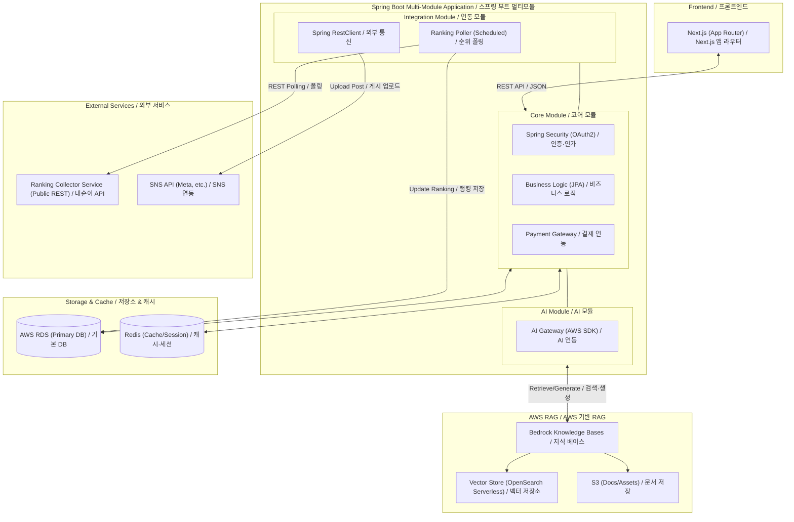

🍃 D-PLOG All-Spring 통합 백엔드 기획서 (AWS RAG 적용)

본 문서는 모든 백엔드 로직을 Spring Boot 생태계로 통합하고, RAG는 AWS 관리형 서비스를 사용하여 개발 효율성과 데이터 정합성을 극대화한 설계안입니다.

## 1. 아키텍처 요약 (Visual Overview)

## 2. 통합 아키텍처의 장점 (Why All-Spring?)
- 기술 스택 단일화: 자바/코틀린 기반의 단일 언어 환경으로 개발 및 운영 효율성 극대화
- 트랜잭션 보장: 비즈니스 로직, 데이터 수집, AI 연산 결과 저장까지 이어지는 복잡한 로직의 원자성(Atomicity) 확보
- 엔터프라이즈급 안정성: Spring Security, Spring Batch 등 검증된 프레임워크를 통한 서비스 안정성 확보

## 3. Spring Boot 기반 서비스 모듈 설계

하나의 서버 프로젝트 내에서 기능별로 모듈을 나누는 멀티 모듈(Multi-Module) 구조를 권장합니다.

1) [Core Module] 서비스 핵심 로직  
역할: 사용자 인증, 결제, 상점 관리, 기본 API 제공  
기술: Spring Data JPA, Spring Security, QueryDSL  
특징: 데이터 정합성이 중요한 B2B SaaS의 핵심 기반 담당

2) [AI Module] AWS RAG 연동  
역할: RAG 검색/생성 요청을 AWS Bedrock Knowledge Bases로 위임  
기술: AWS SDK for Java (Bedrock Agent Runtime), Spring Boot  
RAG 구현: Retrieve / RetrieveAndGenerate 호출로 검색 및 생성 수행. 벡터 저장소는 OpenSearch Serverless를 사용하고, 문서 소스는 S3에 적재

3) [Integration Module] 순위 조회 폴링 + 외부 통신  
역할: 외부 순위 수집 서비스에 REST API 폴링, SNS/외부 API 연동  
기술: Spring RestClient (Spring 6.1+), WebClient, Scheduler  
특징: 퍼블릭 엔드포인트 대상 폴링 및 연동을 Spring 내에서 직접 처리

## 4. 상세 설계 (폴링/스케줄링/인증)

1) 폴링 설계 (내순이/Ranking Collector 연동)  
D-PLOG는 외부 순위 수집 서비스(퍼블릭 REST)에서 데이터를 가져오며, 서버 간 통신은 WebClient 기반으로 수행합니다.  
요청 경로 예시: `http://{nomadscrap-server.ip}/v1/nplace/rank/realtime`  
인증 방식: `apiKey` 쿼리 파라미터로 전달 (서버 간 호출 전용, 클라이언트 노출 금지)  
구현 레퍼런스: `NomadscrapNplaceRankRealtimeRepository`, `NomadscrapNplaceRankTrackInfoRepository`, `NomadscrapNplaceRankTrackStateRepository`  
설정 키: `nomadscrap-server.ip`, `nomadscrap-server.domain`, `nomadscrap-server.api-key`

2) 스케줄링 설계  
일일 스냅샷 저장: `NplaceRankScheduler.saveRealtime()`  
스케줄: `0 0 14 * * *` (서버 타임존 기준)  
동작: 트랙 상태를 반복 조회하며 완료될 때까지 60초 간격 폴링 후 일일 데이터 저장  
보상/등록 확인: `NplaceRewardPlaceScheduler.confirmRegister()`  
스케줄: `0 * * * * *` (매 분)  
세션 정리: `SessionManager.cleanupExpiredSessions()`  
스케줄: `0 * * * * ?` (매 분, 12시간 이상 미접속 세션 제거)

3) 인증 설계  
세션 기반 인증이 기본이며, 로그인 시 `HttpSession`에 `authInfo`를 저장합니다.  
동시 로그인 제어는 `SessionManager`가 수행하며, 사용자별 단일 세션을 유지합니다.  
외부 로그인은 `KakaoOAuthService` 기반 OAuth2 콜백 처리로 계정 생성 및 세션 설정을 수행합니다.  
권한 검증은 컨트롤러/서비스에서 `authInfo` 및 권한(ADMIN/EMPLOYEE 등) 체크로 처리합니다.  
JWT 토큰 발급 모듈(`SecurityTokenProvider`)은 존재하나, 현재 필터 체인에 기본 활성화되어 있지 않으므로 향후 확장 옵션으로 둡니다.

## 5. 기능별 구현 전략 (All-Spring + AWS RAG)

1) RAG 엔진  
AWS Bedrock Knowledge Bases를 사용해 검색 및 생성 수행. Spring Boot에서는 AWS SDK로 `Retrieve`/`RetrieveAndGenerate` 호출

2) 순위 조회 & 추적  
외부 순위 수집 서비스(퍼블릭 REST)에서 D-PLOG가 스케줄링 폴링으로 데이터 요청

3) SNS 업로드  
Spring RestClient/WebClient로 외부 API 연동 및 게시 처리

4) 리포트 생성  
Spring Batch + Apache POI / JasperReports로 배치 리포트 생성

## 6. 데이터베이스 및 인프라 (Spring 중심)

[Database]  
Main: AWS RDS (Primary DB)  
Vector: OpenSearch Serverless (RAG Vector Store)  
Cache: Redis (Session 관리 및 API 캐싱)  
Docs: S3 (RAG 소스 문서 적재)

[Infra - AWS]  
Compute: AWS ECS (Fargate)  
단일 서비스로 배포하거나, 무거운 AI 연산 모듈만 별도 컨테이너로 분리해 오토스케일링 적용  
CI/CD: GitHub Actions 단일 파이프라인 배포 (빌드 도구: Gradle)

## 7. 기대 효과 및 고려사항

✅ 기대 효과  
- 인력 관리 효율: 자바 개발자 위주의 팀 구성으로 채용 및 협업 용이
- 코드 재사용성: DTO, 엔티티, 유틸리티 코드를 모든 모듈에서 공유 가능
- 유지보수: 라이브러리 버전 관리 및 보안 취약점 대응을 한곳에서 처리

⚠️ 고려사항  
- 비용/지연: Bedrock 사용량 기반 과금 및 호출 지연(네트워크) 고려 필요
- 벡터 스토어 운영: OpenSearch Serverless 용량/비용 스케일링 정책 점검 필요
- 리소스 점유: Java VM 특성상 초기 메모리 점유율이 높으므로 인스턴스 사양 최적화 필요
