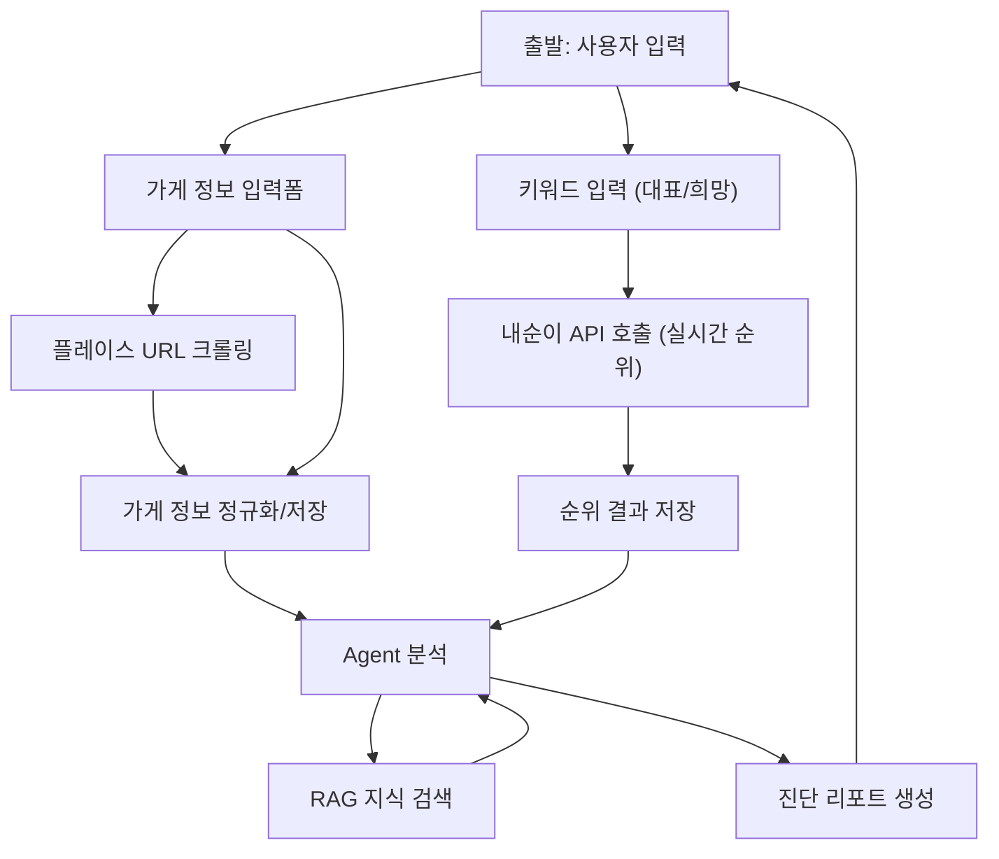

# 내 가게 진단 흐름 설계

## 1. 목적
유저가 입력한 가게 정보와 키워드에 대해, 내순이(순위 수집 서비스)로 실시간 노출 순위를 조회하고, Agent가 RAG 지식(키워드 노출 분석)을 결합해 진단 리포트를 생성한다.

## 2. 전체 흐름 (요약)
1. 유저가 가게 정보를 입력한다.
2. 대표 키워드 5개, 노출 희망 키워드 5개를 입력한다.
3. 내순이 API로 키워드별 실시간 순위를 조회한다.
4. Agent가 순위 + RAG 지식을 결합해 진단 리포트를 생성한다.

## 3. 흐름 상세
### 3.1 Step 1. 가게 정보 수집
1) 입력 경로  
유저 입력폼을 기본 경로로 제공한다.  

2) 네이버 플레이스 URL 처리  
네이버 플레이스 URL이 제공되면 크롤링 API로 메타 정보를 수집한다.  
수집 항목 예시: 상호명, 카테고리, 주소, 전화번호, 운영 시간, 대표 이미지.  

3) 저장  
정규화된 가게 정보를 DB에 저장하고 진단 요청 컨텍스트에 연결한다.

### 3.2 Step 2. 키워드 입력
1) 대표 키워드 5개 입력  
서비스의 핵심 검색 유입 키워드로 취급한다.  

2) 희망 키워드 5개 입력  
확장/성장 목표 키워드로 취급한다.  

3) 유효성 검사  
중복/금칙어/길이 제한을 체크하고 키워드 세트를 저장한다.

### 3.3 Step 3. 내순이 실시간 순위 조회
1) 호출 방식  
D-PLOG 서버가 내순이 퍼블릭 REST API를 폴링 방식으로 호출한다.  
인증은 `apiKey` 쿼리 파라미터 방식으로 전달한다.  

2) 요청 예시  
`GET http://{nomadscrap-server.ip}/v1/nplace/rank/realtime?apiKey=***&keyword=...&province=...`  

3) 결과 처리  
키워드별 순위, 변동 정보, 노출 위치를 진단 컨텍스트에 저장한다.

### 3.4 Step 4. Agent + RAG 진단 리포트 생성
1) 입력 조합  
가게 정보 + 키워드 목록 + 실시간 순위 결과를 결합한다.  

2) RAG 지식 검색  
키워드 노출 분석(노출 요인/경쟁 구도/콘텐츠 전략 등)을 지식베이스에서 검색한다.  
지식 저장소: Bedrock Knowledge Bases + OpenSearch Serverless + S3.  

3) Agent 판단  
순위 결과와 RAG 지식을 비교해 “근거 기반” 진단을 생성한다.  

4) 리포트 출력 형식  
요약, 근거, 개선 포인트, 즉시 실행 항목, 우선순위로 구성한다.

## 4. Mermaid 흐름도

## 5. 인증/보안 요약
1) 사용자 인증  
D-PLOG는 세션 기반 인증을 사용하며, 로그인 시 `HttpSession`에 `authInfo`를 저장한다.  

2) 서비스 간 인증  
내순이 API 호출은 `apiKey` 쿼리 파라미터로 전달한다.  

3) 민감 정보 관리  
`apiKey`, 크롤링 토큰 등은 환경 변수로 관리하고 클라이언트에 노출하지 않는다.

## 6. 실패/예외 처리
1) 크롤링 실패  
입력폼 데이터를 기준으로 진단을 진행하고, 실패 사유를 리포트에 명시한다.  

2) 순위 조회 실패  
최근 캐시 데이터로 대체하거나 “부분 결과”로 리포트를 생성한다.  

3) RAG 응답 실패  
기본 템플릿 기반 리포트를 생성하고 재시도 큐에 기록한다.

## 7. 산출물
1) 진단 결과 리포트  
요약, 근거, 개선안, 실행 플랜, 키워드별 코멘트  

2) 내부 저장 데이터  
진단 요청 컨텍스트, 키워드 세트, 순위 결과, 리포트 히스토리
