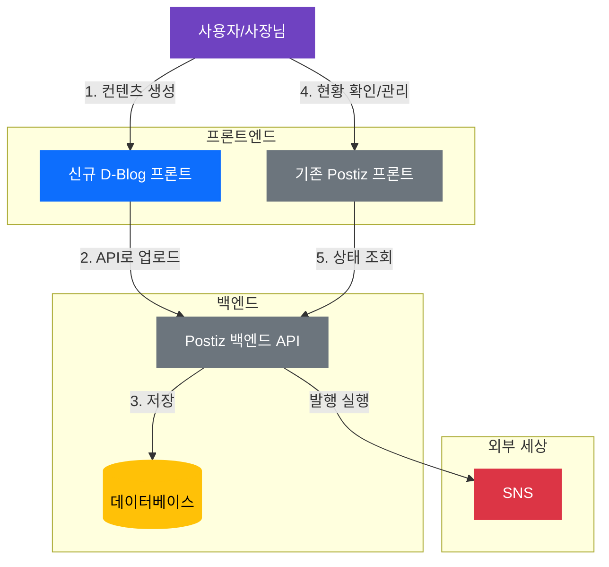
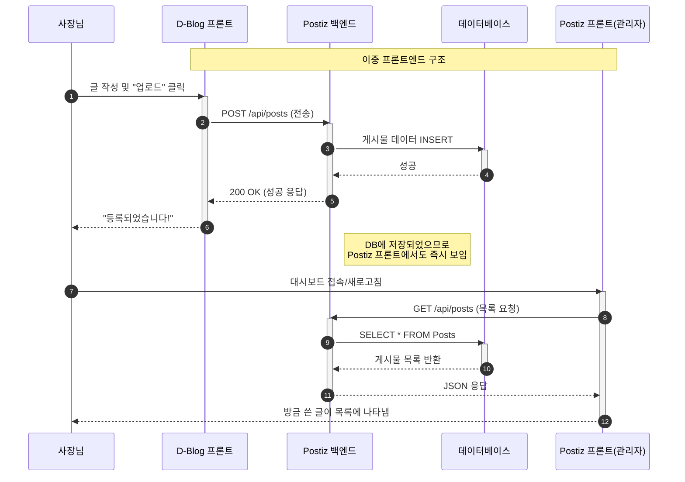
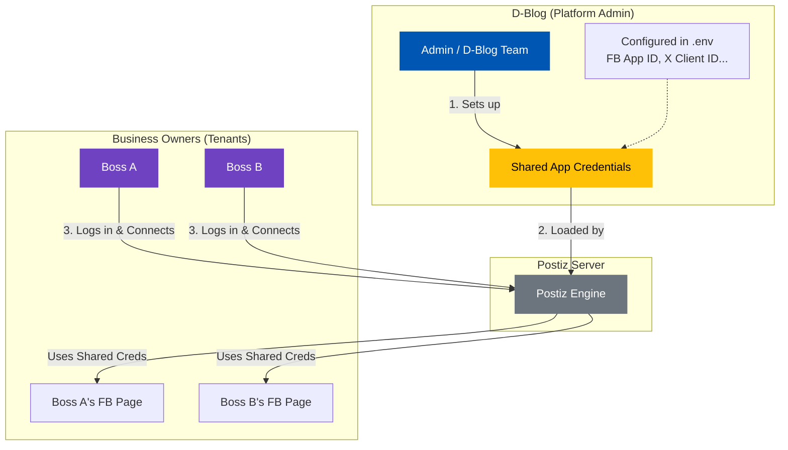
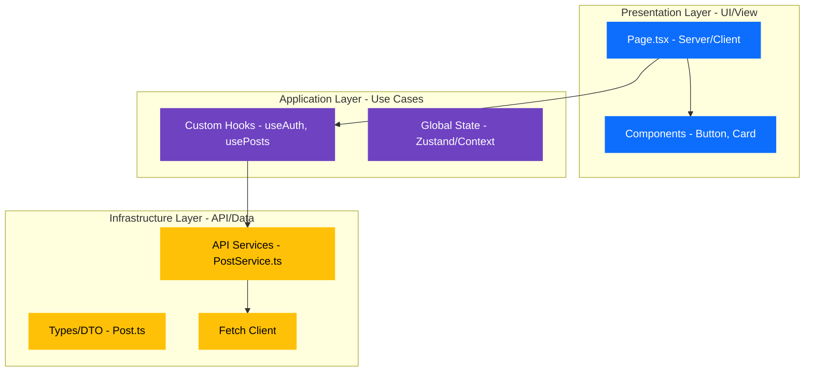

# Postiz & D-Blog 통합 설계안

## 아키텍처 개요 (Architecture Overview)

이 시스템은 **하나의 공통 백엔드(Postiz)**를 공유하는 **두 개의 프론트엔드**로 구성됩니다. 이를 통해 데이터 정합성을 유지하면서 Postiz의 강력한 SNS 배포 기능을 그대로 활용할 수 있습니다.

### 핵심 개념: "원 백엔드, 멀티 프론트엔드"

1.  **D-Blog 프론트엔드 (신규, 사장님용)**:
    *   **목적**: 글쓰기에 집중된 심플한 인터페이스.
    *   **행동**: 사장님이 여기서 홍보글을 작성합니다.
    *   **연동**: Postiz API를 호출하여 글을 "업로드"하거나 "예약"합니다.

2.  **Postiz 프론트엔드 (기존, 관리자용)**:
    *   **목적**: 전체 현황 관리, 상세 설정, 통계 분석.
    *   **행동**: 대표님이 전체 연결 상태를 점검하거나 예약 대기열을 확인합니다.
    *   **연동**: Postiz 백엔드와 직접 연결되어 있습니다.

3.  **Postiz 백엔드 (공유 엔진)**:
    *   **목적**: 모든 데이터의 저장소이자 실행 엔진.
    *   **행동**: D-Blog에서 넘어온 데이터를 DB에 저장하고, 약속된 시간에 페이스북/인스타로 쏘아줍니다.

### 데이터 흐름 및 상태 동기화

**D-Blog**에서 글을 작성하면 벌어지는 일:
1.  D-Blog가 **Postiz 백엔드 API**로 데이터를 보냅니다.
2.  백엔드가 이를 **DB**에 저장합니다.
3.  **Postiz 프론트엔드**는 (백엔드를 통해) 같은 DB를 보고 있으므로, 새로고침하거나 대시보드에 들어가면 **방금 사장님이 쓴 글이 "예약됨" 상태로 즉시 보입니다.**

## 시각적 구조도 (Visual Diagrams)

### 1. 시스템 아키텍처



### 2. 상호작용 흐름 (시퀀스)

D-Blog에서 쓴 글이 어떻게 Postiz에 등록되는지 보여주는 순서도입니다.


## 사용자 및 앱 관리 (에이전시 모델)

질문하신 내용: *"디블로그가 관리자가 되어 사장님들이 앱을 따로 신청하지 않게 할 수 있나요?"*

**답변: 네, 가능합니다.**

이 시스템은 **"공용 애플리케이션(Shared Application)"** 모드로 작동합니다.
1.  **D-Blog (대표님)**: 페이스북/트위터/링크드인에 "개발자"로 딱 한 번만 등록합니다.
2.  **시스템**: Postiz는 이 "마스터 키"를 사용하여 서버 전체를 운영합니다.
3.  **비즈니스 오너 (사장님)**: Postiz(또는 D-Blog)에 로그인하여 "연동하기" 버튼만 누르면 됩니다. **개발자 키를 따로 발급받을 필요가 없습니다.**

### 계층 구조 및 권한



### 핵심 이점
*   **사장님**: 복잡한 설정 없이 "페이스북으로 로그인" 버튼 하나만 누르면 끝납니다.
*   **D-Blog**: 기술적인 복잡함은 중앙에서 대표님이 관리합니다.

## 앱 설정 및 브랜딩 상세

질문하신 내용: *"D-Blog가 승인을 받는 건가요? 사용자에게 D-Blog가 보이나요? 리다이렉트는요?"*

### 1. 누가 승인을 받는가? (서비스의 "얼굴")
*   **대표님 (D-Blog)**이 `developers.facebook.com`, `developer.twitter.com` 등에 가서 **"D-Blog"** (또는 원하시는 서비스명)라는 이름으로 앱을 등록해야 합니다.
*   **심사**: **D-Blog** 이름으로 심사를 넣습니다. "이 앱은 비즈니스 오너들의 게시물 관리를 돕는 도구입니다"라고 소명합니다.
*   **사용자 경험**: 사장님이 계정을 연동할 때 다음과 같은 팝업을 보게 됩니다:
    > *"**D-Blog**이(가) 회원님의 Facebook 페이지에 접근하려고 합니다. 허용하시겠습니까?"*
    *   사장님 눈에는 "Postiz"가 아니라, 대표님의 브랜드인 **D-Blog**가 보입니다.

### 2. 엔진 (내부 "두뇌")
*   내부적으로 **Postiz**는 대표님이 승인받은 "D-Blog 앱 키"를 설정(`env`)에 넣어서 작동합니다.
*   Postiz는 승인받은 자격 증명을 사용하여 API와 통신하는 **대리인** 역할을 합니다.

### 3. 리다이렉트 URI (인증 연결 고리)
로그인이 정상적으로 되려면, 소셜 개발자 콘솔에서 **Redirect URI**를 Postiz 서버 주소로 설정해야 합니다.

*   **소셜 앱 설정**:
    *   **앱 이름**: D-Blog
    *   **유효한 OAuth 리다이렉트 URI**: `https://your-postiz-server.com/api/auth/callback/facebook` (예시)
    
*   **인증 흐름**:
    1.  사장님이 D-Blog/Postiz에서 "연동하기" 클릭
    2.  페이스북으로 이동 -> "D-Blog에게 권한을 주시겠습니까?" 팝업
    3.  사장님이 "예" 클릭
    4.  페이스북이 다시 `https://your-postiz-server.com/...` (Postiz 서버)로 돌려보냄
    5.  Postiz가 이를 받아 토큰을 저장하고 연동 완료

## 앱 승인 현실 점검 (난이도)

질문하신 내용: *"앱 승인받는 게 엄청 어렵다던데 사실인가요?"*

**답변: 네, 특히 페이스북(Meta)이 그렇습니다.**
하지만 한 번만 넘으면 되는 산입니다.

| 플랫폼 | 난이도 | 비용 | 핵심 장벽 |
| :--- | :--- | :--- | :--- |
| **Meta (FB/Insta)** | 🔴 **최상** | 무료 | **비즈니스 인증 (Business Verification)**. 실제 사업자 등록증이 필요합니다. 또한 데이터 사용 방식을 보여주는 **"스크린캐스트(동영상)"**를 제출해야 합니다. |
| **X (Twitter)** | 🟡 **중간** | **유료** | 무료 티어는 "쓰기 전용"으로 제한적입니다. 제대로 쓰려면 Basic 티어(월 $100)를 유도합니다. 키 발급 자체는 쉽지만 기능 제한이 있습니다. |
| **LinkedIn** | 🟢 **쉬움** | 무료 | 기본 생성은 즉시 가능합니다. 더 풍부한 기능을 위한 "Marketing Developer Platform" 권한은 신청서를 써야 하지만 비교적 쉽습니다. |

### 성공 전략 (Meta/Facebook)
1.  **비즈니스 인증 필수**: 개인 계정으로는 불가능합니다. "D-Blog" 이름으로 된 비즈니스 관리자 계정을 만들고 서류 인증을 받아야 합니다.
2.  **스크린캐스트**: 사용자가 로그인하고 -> 연동하고 -> 글을 발행하는 과정을 영상으로 찍어야 합니다. (아직 앱을 안 만들었는데 영상이 필요하다는 게 모순 같지만, **팁**: Postiz를 백엔드로 두고 UI를 먼저 간단히 만들거나, 승인 없이 테스트 가능한 "테스트 유저" 기능을 이용해 영상을 찍어서 제출하세요.)
3.  **개인정보처리방침 (Privacy Policy)**: 사이트에 명확한 개인정보처리방침 URL이 있어야 합니다.

> **대안**: 초기에 승인이 너무 어렵다면, 일단은 앱 연동 없이 **"수동 채널(Manual Channels)"** (Postiz가 알림만 보내주는 방식)로 시작하거나, 비교적 쉬운 LinkedIn/X 부터 연동하면서 Meta 승인을 준비하는 것도 방법입니다.

## D-Blog 프론트엔드 제작 계획

요청하신 "간단하지만 확장성 있는 프론트엔드" 구축을 위한 아키텍처 추천 및 로드맵입니다.

### 1. 기술 스택 및 아키텍처 추천 (Rank)

**결론부터 말씀드리면: [1순위] Next.js (App Router) + Layered Architecture를 추천합니다.**
이유: SEO 친화적, 최신 표준, 유지보수 용이성, 그리고 "서버 사이드 로직"을 쉽게 섞어 쓸 수 있어 Postiz API 연동 시 보안(토큰 관리 등)에 유리합니다.

| 순위 | 아키텍처 / 스택 | 특징 | 장점 | 단점 | 추천 대상 |
| :--- | :--- | :--- | :--- | :--- | :--- |
| **🥇 1** | **Next.js (App) + Layered** | 프레젠테이션(UI)과 비즈니스 로직(Service/Hook)을 명확히 분리 | **표준적이고 깔끔함**. 팀원 누구나 이해하기 쉽고, Next.js의 강력한 기능 활용 가능. | 초기 파일 구조 잡는데 약간의 고민 필요. | **D-Blog (강력 추천)** |
| 🥈 2 | React (Vite) + FSD | Feature-Sliced Design (기능 단위 분할) | **확장성 최강**. 기능이 수백 개로 늘어나도 폴더 구조가 무너지지 않음. | **러닝 커브 높음**. 파일이 아주 많아짐. 소규모일 땐 과함. | 초대형 대시보드 |
| 🥉 3 | Next.js (Pages) + Atomic | 고전적인 Atomic Design (Atoms -> Molecules...) | 디자인 컴포넌트 재사용성 극대화. | 비즈니스 로직 위치가 애매해질 수 있음. (UI 중심 설계) | 디자인 시스템이 매우 중요할 때 |

### 2. 추천 아키텍처 상세 구조 (Layered Architecture)

Next.js App Router 내에서 **관심사를 분리**하여 유지보수성을 높입니다.



*   **Presentation**: 화면을 그립니다. 로직은 커스텀 훅으로 위임합니다.
*   **Infrastructure**: `Postiz` API와 실제 통신하는 코드는 여기에만 있습니다. (나중에 백엔드가 바뀌어도 여기만 수정하면 됨)

---

### 3. 단계별 개발 로드맵 (Phased Plan)

빠르게 핵심 기능을 구현하고 확장해 나가는 5단계 계획입니다.

#### **Phase 1: 프로젝트 세팅 및 기반 마련 (Foundation)**
*   **목표**: "Hello World"가 뜨고, API 통신이 가능한 상태.
*   **할 일**:
    *   Next.js (App Router) + TypeScript + Tailwind CSS 설치.
    *   `src/shared/api` 폴더에 Axios 인스턴스 생성 (Postiz API URL 설정).
    *   기본 레이아웃 (Header, Sidebar) 퍼블리싱.

#### **Phase 2: 인증 및 연동 (Auth & Connection)**
*   **목표**: 사용자가 로그인하고, 내 소셜 계정 상태를 볼 수 있어야 함.
*   **할 일**:
    *   **로그인 페이지**: Postiz API 로그인 연동.
    *   **토큰 관리**: JWT를 쿠키나 로컬스토리지에 저장하는 로직 구현.
    *   **설정 페이지**: "SNS 연동하기" 버튼 구현 (누르면 연동 팝업 뜨게).

#### **Phase 3: 핵심 기능 - 게시물 작성 (Editor)**
*   **목표**: 사장님이 글을 쓰고 "예약" 버튼을 누를 수 있음.
*   **할 일**:
    *   **에디터 UI**: 텍스트 입력창 + 이미지 업로드 영역.
    *   **소셜 선택기**: "어디에 올릴까요?" (페이스북/인스타 체크박스).
    *   **API 연동**: 작성 완료 시 `POST /api/posts` 호출.

#### **Phase 4: 대시보드 - 현황판 (Dashboard)**
*   **목표**: 내가 쓴 글이 잘 올라갔는지 확인.
*   **할 일**:
    *   **캘린더/리스트 뷰**: 날짜별 예약 현황 보여주기.
    *   **상태 표시**: 대기중(🟡), 게시됨(🟢), 실패(🔴) 뱃지 UI.
    *   **삭제/수정**: `DELETE /api/posts/{id}` 등 연동.

#### **Phase 5: 고도화 - 통계 및 멤버십 (Analytics)**
*   **목표**: 사장님에게 "효과"를 보여주기.
*   **할 일**:
    *   Postiz가 제공하는 간단한 통계(좋아요 수 등)를 차트로 시각화 (Recharts 사용 추천).
    *   사용자 프로필 수정 등 부가 기능.

## 미래 로드맵: D-Blog 독자 엔진화 (Independence)

질문하신 내용: *"나중에 포스티즈 엔진을 따로 디플로그 엔진으로 탈바꿈시킬 수도 있나요?"*

**답변: 네, 충분히 가능합니다.**
현재는 개발 속도를 위해 Postiz를 사용하지만, 서비스가 커지면 다음 3단계로 **"D-Blog만의 독자 엔진"**으로 진화할 수 있습니다.

### 단계별 독립 전략 (Evolution Path)

| 단계 | 상태 | 설명 | 난이도 |
| :--- | :--- | :--- | :--- |
| **1단계 (현재)** | **Headless 사용** | Postiz를 그대로 두고, 프론트엔드만 D-Blog 것을 씁니다. "엔진"은 Postiz지만 사용자 눈에는 안 보입니다. | ⭐ 하 |
| **2단계 (포크 & 커스텀)** | **엔진 개조 (Fork)** | Postiz 오픈소스 자체를 우리가 수정합니다. 내부 로직을 바꾸거나 "Postiz" 흔적을 코드 레벨에서 지우고 **"D-Blog Engine"**으로 명명하여 운영합니다. | ⭐⭐ 중 |
| **3단계 (완전 독립)** | **독자 엔진 구축** | Postiz가 불필요해질 만큼 우리만의 기능이 많아지면, 핵심 기능(스케줄러, SNS API 연동기)만 남기고 새로 만듭니다. DB는 그대로 마이그레이션 가능합니다. | ⭐⭐⭐ 상 |

### 결론
지금 Postiz를 쓰는 것은 나중에 발목을 잡는 것이 아니라, **"거인의 어깨"에서 시작하는 것**입니다. 나중에 언제든 우리 입맛에 맞게 개조(Fork)하거나 교체할 수 있는 구조이므로 안심하고 진행하셔도 됩니다.
```