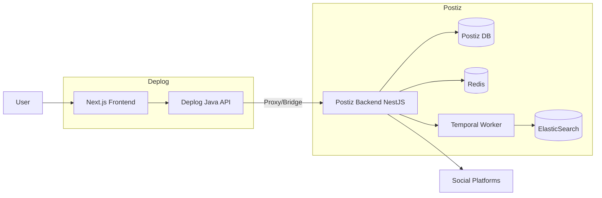
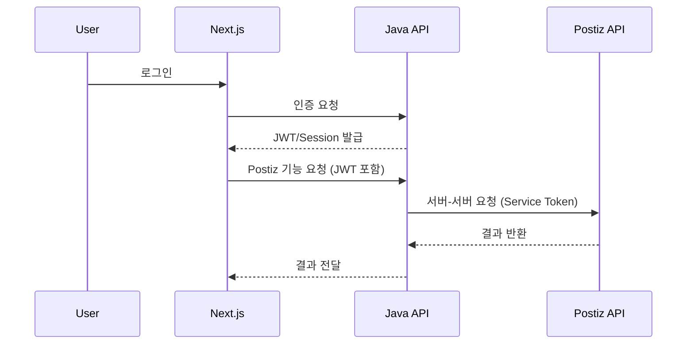

# Deplog + Postiz 통합 아키텍처 (초안)

## 목표
- 기존 Deplog(Next 프론트 + Java 백엔드) 구조를 유지
- Postiz 기능을 독립 서비스로 붙여서 빠르게 출시
- 인증/권한은 Deplog에서 통제

---

## 권장 구성 (옵션 B: 프록시 통합)
- **프론트(Next.js)**: 기존 유지, Postiz 관련 요청은 Deplog API로 보냄
- **백엔드(Java)**: 메인 인증/권한, Postiz API를 프록시/브릿지
- **Postiz 백엔드(NestJS)**: 소셜 채널 연결, 예약 발행, 워커/Temporal
- **DB/Redis/Temporal**: Postiz 전용 인프라로 분리

---

## 구성도 (Mermaid)

---

## 인증 플로우 (Mermaid Sequence)

---

## API 브릿지 전략

### 1) Java가 모든 Postiz API를 프록시
- 장점: CORS/인증 통합 쉬움
- 단점: 프록시 레이어 관리 필요

### 2) 프론트가 직접 Postiz API 호출
- 장점: 속도/단순성
- 단점: 토큰/권한 분리, CORS 관리 복잡

**추천:** 운영 안정성을 위해 **Java 프록시** 방식

---

## 데이터 경계

- **Deplog DB**: 사용자/구독/결제/권한
- **Postiz DB**: 게시물/예약/채널 연동/토큰
- 서로 직접 조인하지 않음 (API 통신으로만 연계)

---

## 배포 구성

### Deplog 영역
- Next.js (existing)
- Java API (existing)

### Postiz 영역
- Postiz API (NestJS)
- PostgreSQL
- Redis
- Temporal + Elasticsearch

---

## 보안 포인트

- Postiz는 **내부망 또는 전용 서브도메인** 사용
- Java → Postiz 통신은 **Service Token**으로 보호
- Postiz의 OAuth 리다이렉트 URL은 Deplog 도메인 기준으로 설정

---

## 다음 단계
1. Java ↔ Postiz 인증 브릿지 설계
2. Postiz API 엔드포인트 목록 추출
3. 프론트 기능 단위로 라우팅 정의
4. 환경변수/시크릿 관리 전략 수립
